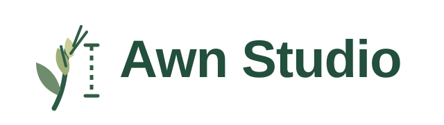
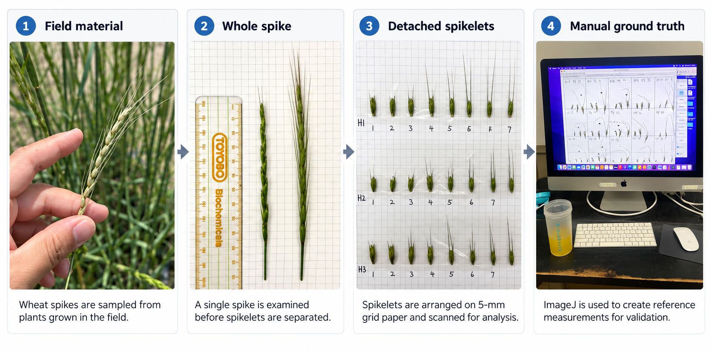
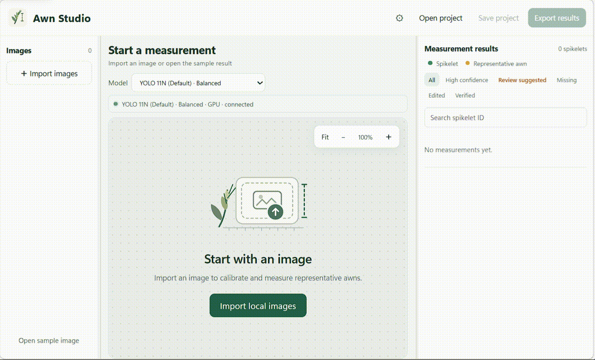
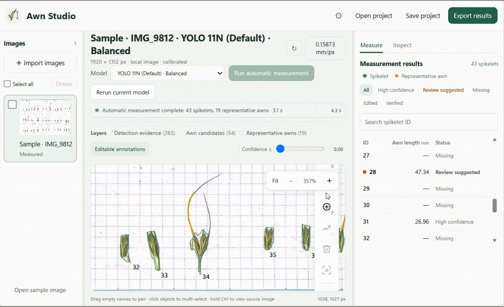
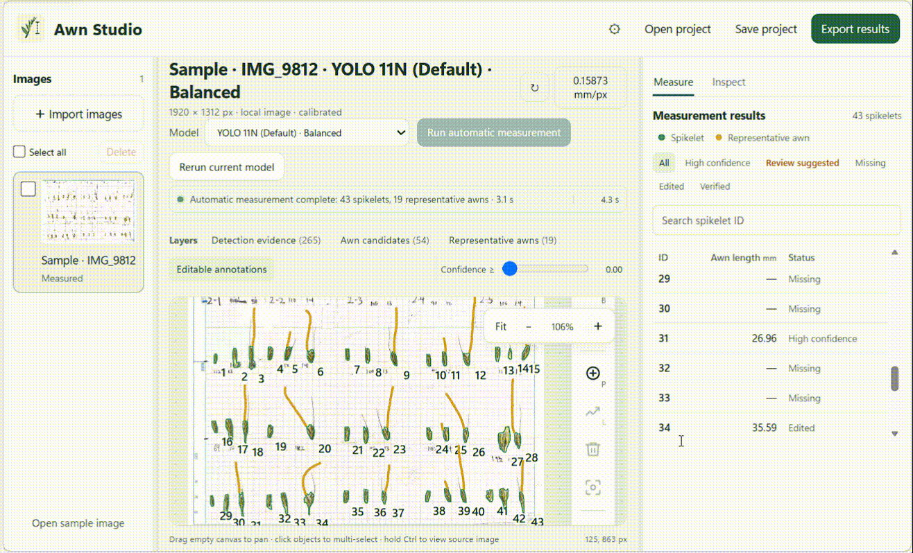
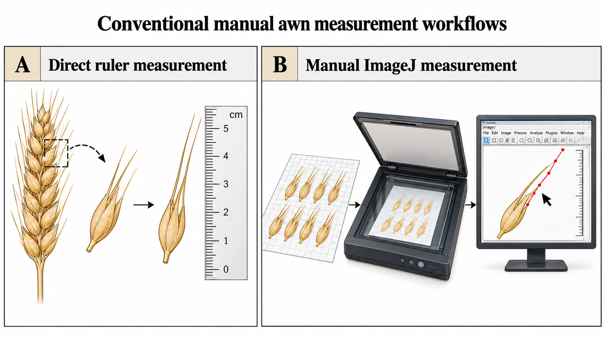

<p align="center">
  
</p>

<p align="center">
  <strong>Semi-automated wheat awn length measurement from digitized spikelet images.</strong>
</p>

Awn Studio is a semi-automated platform for measuring wheat awn length from digitized spikelet images. It detects spikelets and awns, reconstructs measurable awn centerlines, estimates calibrated lengths, and keeps the user in the loop through an interactive review and correction workflow.

Instead of treating model predictions as final answers, Awn Studio turns automatic recognition into an editable measurement workflow: the software proposes the awn path, the user can inspect or correct it, and reviewed measurements can be exported for downstream phenotyping analysis.

---

## From wheat spike to measurement

Awn Studio measures the long, bristle-like **awns** that extend from wheat spikelets. Before analysis, the plant material is prepared as an organized digital image of detached spikelets.

<p align="center">
  
</p>

The resulting digitized spikelet pages provide a consistent input for automated measurement, while manual measurements from the same material can be used as reference data for validation.

---

## What can Awn Studio do?

A typical workflow starts with a digitized page of wheat spikelets and ends with reviewed, exportable awn-length measurements.

### Automatically detect and measure awns

Awn Studio automatically identifies spikelets and awn evidence from digitized pages, reconstructs a representative awn path for each spikelet, and converts that path into a calibrated length measurement.

<p align="center">
  
</p>

### Review and correct the result

Automatic results remain editable. Users can inspect each spikelet, adjust the awn path, add a missing awn, or remove an incorrect path before accepting the measurement.

<p align="center">
  
</p>

### Export phenotype measurements

Once review is complete, Awn Studio can export the measurements for downstream analysis instead of leaving the result trapped inside a visualization.

<p align="center">
  
</p>

---

## Why Awn Studio?

Conventional awn measurement is usually done either directly with a ruler or manually from digital images in tools such as ImageJ.

<p align="center">
  
</p>

Both approaches work well at small scale, but become slow and repetitive when hundreds of spikelets need to be measured consistently.

> **Why I built Awn Studio**  
> In one phenotyping experiment, I manually measured awns from more than 500 accessions, covering nearly 5,000 individual awn instances. The samples had already been digitized, yet tracing and measuring the awns one by one in ImageJ still took more than 100 hours and over two weeks of work. That experience made the bottleneck very clear: the measurement step itself needed to become much faster.

Awn Studio was built to reduce that manual workload while keeping the result inspectable and editable before export.

---

## From a digitized image to awn length

The public workflow is designed around a simple user-facing sequence:

```text
Digitized spikelet page
        |
        v
Automatic awn & spikelet recognition
        |
        v
Awn path reconstruction
        |
        v
Representative awn selection
        |
        v
Calibrated length measurement
        |
        v
Review & correction in Awn Studio
        |
        v
Export
```

---

## How does it work?

This section gives a short technical view of the maintained pipeline. Detailed implementation notes belong in the documentation rather than in the first half of the README.

### 1. Awn and spikelet recognition

The canonical public model is a YOLO11N instance-segmentation model trained to recognize two classes:

- **awn**
- **spikelet**

Large scanned pages are processed with overlapping tiles so that thin structures can be detected without reducing the full page to a very small image.

### 2. Awn path reconstruction

Raw predictions are treated as image evidence rather than final measurements. Awn Studio associates compatible fragments with the relevant spikelet and progressively reconstructs candidate awn paths using local geometry and supporting evidence.

A representative path is then selected for measurement.

### 3. Physical measurement

The selected path is normalized to the spikelet root, simplified for stable measurement, and converted from pixels to millimetres using image calibration.

Automatic grid calibration is accepted only when its quality-control checks pass; otherwise the user can provide an explicit manual calibration.

### 4. Human-in-the-loop review

Awn Studio exposes the automatic result rather than hiding it behind a single number. Users can inspect the image evidence and final path, correct mistakes, rerun measurements when needed, and export the reviewed result.

---

## Awn Studio

The interactive workspace is designed for reviewing automatic measurements without returning to a separate annotation program.

Current core interactions include:

- inspect automatically measured spikelets and awns;
- use **Review Suggested** to prioritize measurements that deserve attention;
- compare image evidence, candidate paths, and the selected representative awn;
- drag or redraw an awn path, add a missing awn, or delete an incorrect path;
- confirm reviewed measurements directly beside the selected awn;
- rerun after changing the model or calibration;
- save/reopen projects and export reviewed phenotype measurements.

The canonical public model remains YOLO11N. In **Settings -> Measurement**, users can also register another compatible local Ultralytics YOLO segmentation checkpoint by path. Selecting a model starts loading it immediately, so a later Run/Rerun does not need to pay the full model-loading cost again. Awn Studio intentionally keeps only one active model loaded at a time to avoid unnecessary GPU-memory use.

---

## Getting started

Python 3.10+ is required.

```bash
git clone https://github.com/Ushiochanii/wheat-awn-phenotyping.git
cd wheat-awn-phenotyping
python -m venv .venv
```

Activate the environment and install Awn Studio:

```bash
# macOS / Linux
source .venv/bin/activate

# Windows PowerShell
# .venv\Scripts\Activate.ps1

python -m pip install -e .
```

Run the bundled example:

```bash
awnphen demo
```

Measure your own image:

```bash
awnphen predict path/to/image.jpg --output runs/my-image
```

Launch the interactive interface:

```bash
awnphen studio
```

> **Naming note:** Awn Studio is the public platform name. The current Python package and command-line entry point remain `awnphen` for compatibility.

---

## What does Awn Studio produce?

Depending on the workflow, outputs can include:

- calibrated awn-length measurements;
- reconstructed awn centerlines;
- representative-awns associated with spikelets;
- intermediate visual evidence for review;
- editable Awn Studio project state;
- CSV measurement export;
- reproducible run artifacts and reports.

---

## Model and reproducibility

The canonical public checkpoint is hosted on Hugging Face:

`anpanchanii/awnphen-yolo11n`

Awn Studio pins the canonical model to a specific repository revision and verifies its SHA-256 checksum before use.

The maintained inference configuration uses 640 px model input with overlapping 640 px tiles and stride 320.

The public repository intentionally contains the maintained runtime rather than the full research workspace. Training history, raw research datasets, benchmark workspaces, publication drafts, archived algorithms, caches, and comparison-model checkpoints are excluded.

---

## Current limitations

Awn Studio is semi-automated rather than fully autonomous. Difficult images can still require human correction, particularly when awns are severely occluded, weakly visible, or confused with neighbouring structures.

Automatic physical calibration also depends on a valid scan grid. When automatic calibration fails quality control, an explicit manual calibration is required.

The current maintained measurement contract uses one scalar millimetre-per-pixel value for a page.

---

## Documentation

- [Architecture](docs/architecture.md)
- [Release notes](RELEASE_NOTES.md)
- [Public release code audit](docs/code-audit-2026-10-01.md)

<!-- TODO:
Add a user guide / Awn Studio walkthrough once the local UI stabilizes.
-->

---

## Citation

If you use Awn Studio in research, please cite the software metadata provided in [CITATION.cff](CITATION.cff).

---

## License

Awn Studio is distributed under the GNU Affero General Public License v3.0 (AGPL-3.0). The canonical YOLO11N checkpoint is also released under AGPL-3.0.

See [LICENSE](LICENSE) and [THIRD_PARTY_NOTICES.md](THIRD_PARTY_NOTICES.md) for details.
