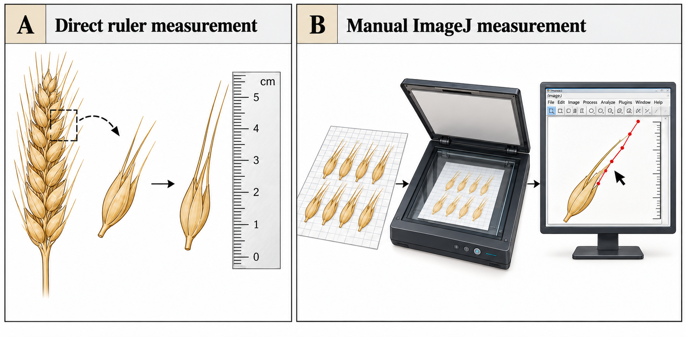
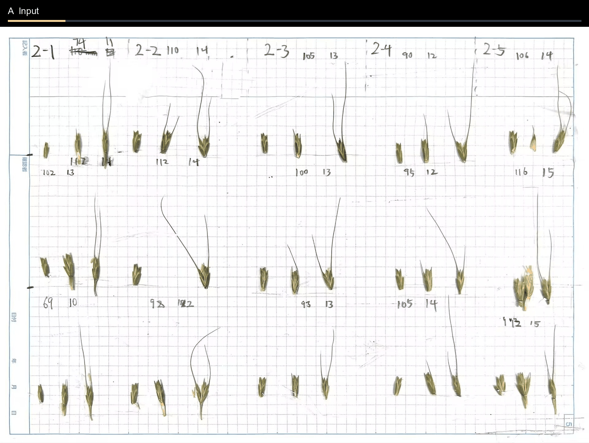

<p align="center">
  
</p>

<p align="center">
  <strong>Semi-automated wheat awn length measurement from digitized spikelet images.</strong>
</p>

Awn Studio is a semi-automated platform for measuring wheat awn length from digitized spikelet images, combining automatic image analysis with human review.

---

## 🌾 From wheat spike to measurement

Awn Studio measures the long, bristle-like **awns** that extend from wheat spikelets. Before analysis, the plant material is prepared as an organized digital image of detached spikelets.

<p align="center">
  
</p>

The resulting spikelet pages provide a consistent digital format for measurement, while the same material can also be measured manually to create reference data for validation.

---

## 💡 Why Awn Studio?

Conventional awn measurement is usually done either directly with a ruler or manually from digital images in tools such as ImageJ.

<p align="center">
  
</p>

Both approaches work well at small scale, but become slow and repetitive when hundreds or thousands of awns need to be measured consistently.

> **Why I built Awn Studio**  
> In one phenotyping experiment, I manually measured awns from more than 500 accessions, covering nearly 5,000 individual awn instances. The samples had already been digitized, yet tracing and measuring the awns one by one in ImageJ still took more than 100 hours and over two weeks of work. That experience made the bottleneck very clear: the measurement step itself needed to become much faster.

Awn Studio was built to reduce that manual workload without turning the result into an opaque black box.

---

## ✨ What can Awn Studio do?

A typical workflow starts with a page of wheat spikelets and ends with reviewed, exportable awn-length measurements.

### Automatically detect and measure awns

Awn Studio identifies spikelets and awn evidence, reconstructs a representative awn path for each spikelet, and converts that path into a calibrated length measurement.

<p align="center">
  
</p>

### Review and correct the result

Automatic results remain editable. Users can inspect each spikelet, adjust the awn path, add a missing awn, or remove an incorrect path before accepting the measurement.

<p align="center">
  
</p>

### Export phenotype measurements

Reviewed measurements can be exported for downstream analysis instead of remaining trapped inside the visualization interface.

<p align="center">
  
</p>

---

## ⚙️ How Awn Studio works

Awn Studio does not treat raw segmentation masks as final measurements. The model first provides visual evidence; the pipeline then turns that evidence into a biologically meaningful, measurable awn path.

<p align="center">
  
</p>

<p align="center"><sub>Image recognition → awn reconstruction → representative awn → calibrated measurement.</sub></p>

### 1. Image recognition

The canonical public model is a YOLO11N instance-segmentation model trained to recognize **awns** and **spikelets**. Large digitized pages are processed with overlapping tiles so that thin awns can be detected without shrinking the full page too aggressively.

### 2. Structural reconstruction

Raw predictions are treated as image evidence rather than finished objects. Compatible fragments are associated with nearby spikelets and progressively assembled into candidate awn paths. One representative awn is then selected for each spikelet.

### 3. Physical measurement

The selected path is normalized at the spikelet base and converted from pixels to millimetres using image calibration. Automatic calibration is used only when its quality checks pass; otherwise an explicit manual calibration can be supplied.

---

## Human-in-the-loop review

Awn Studio keeps the automatic result visible and editable rather than hiding the entire process behind a single number.

Core review actions include:

- inspect the original image, model evidence, candidate paths, and selected awn;
- use **Review Suggested** to prioritize measurements that deserve attention;
- drag or redraw an awn path, add a missing awn, or delete an incorrect path;
- rerun measurements after changing the model or calibration;
- save and reopen projects before exporting reviewed phenotype measurements.

This makes automation the first pass rather than the final authority.

---

## 🚀 Getting started

Python 3.10+ is required.

```bash
git clone https://github.com/Ushiochanii/wheat-awn-phenotyping.git
cd wheat-awn-phenotyping
python -m venv .venv
```

Activate the environment and install Awn Studio:

```bash
# macOS / Linux
source .venv/bin/activate

# Windows PowerShell
# .venv\Scripts\Activate.ps1

python -m pip install -e .
```

Run the bundled example:

```bash
awnphen demo
```

Measure your own image:

```bash
awnphen predict path/to/image.jpg --output runs/my-image
```

Launch the interactive interface:

```bash
awnphen studio
```

> **Naming note:** Awn Studio is the public platform name. The current Python package and command-line entry point remain `awnphen` for compatibility.

---

## Outputs

Awn Studio can produce:

- calibrated awn-length measurements;
- reconstructed awn paths associated with spikelets;
- editable project state for later review;
- CSV phenotype exports;
- reproducible run artifacts for inspection.

---

## Model and reproducibility

The canonical public checkpoint is hosted on Hugging Face:

`anpanchanii/awnphen-yolo11n`

Awn Studio pins the canonical model to a specific repository revision and verifies its SHA-256 checksum before use. The maintained inference configuration uses 640 px model input with overlapping 640 px tiles and stride 320.

Advanced users can also register another compatible local Ultralytics YOLO segmentation checkpoint in **Settings -> Measurement**. Awn Studio keeps only one active model loaded at a time to avoid unnecessary GPU-memory use.

The public repository intentionally contains the maintained runtime rather than the full research workspace. Training history, raw research datasets, benchmark workspaces, publication drafts, archived algorithms, caches, and comparison-model checkpoints are excluded.

---

## Current limitations

Awn Studio is semi-automated rather than fully autonomous. Difficult images can still require human correction, particularly when awns are severely occluded, weakly visible, or confused with neighbouring structures.

Automatic physical calibration depends on a valid calibration grid or other reliable physical reference. When automatic calibration fails quality control, an explicit manual calibration is required.

The current maintained measurement contract uses one scalar millimetre-per-pixel value for a page.

---

## Documentation

- [Architecture](docs/architecture.md)
- [Release notes](RELEASE_NOTES.md)
- [Public release code audit](docs/code-audit-2026-10-01.md)

---

## Citation

If you use Awn Studio in research, please cite the software metadata provided in [CITATION.cff](CITATION.cff).

---

## License

Awn Studio is distributed under the GNU Affero General Public License v3.0 (AGPL-3.0). The canonical YOLO11N checkpoint is also released under AGPL-3.0.

See [LICENSE](LICENSE) and [THIRD_PARTY_NOTICES.md](THIRD_PARTY_NOTICES.md) for details.
